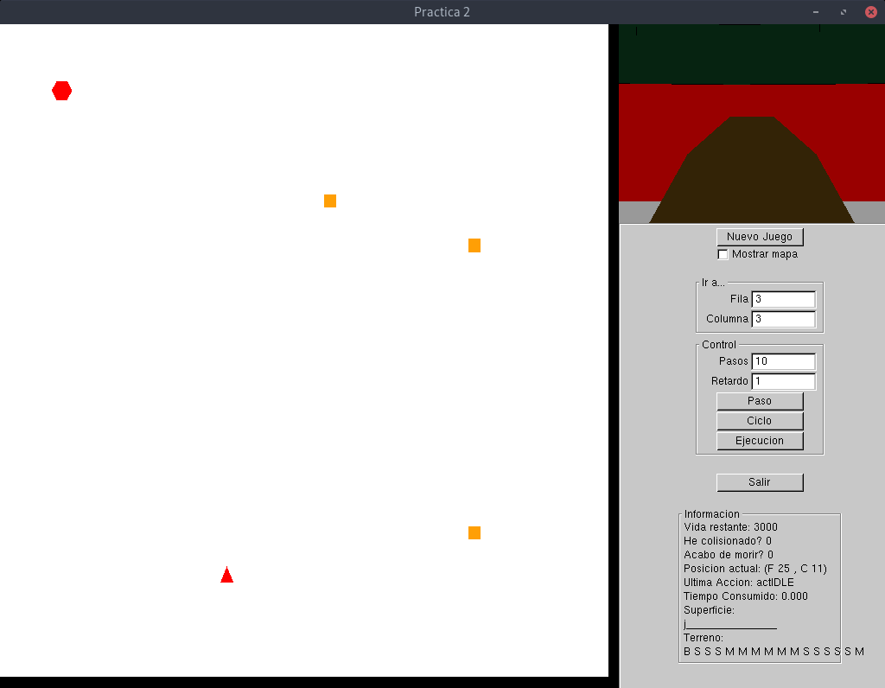

# Practica 2: Los extraños mundos de Belkan

Esta práctica trata sobre desarrollar un agente reactivo/deliberativo

## Documentación

Hay disponibles dos PDFs con documentación, uno de ellos es un resumen, ajustandose a las 5 páginas que nos piden en la entrega, mientras que el otro explica paso a paso todo el codigo desarrollado.


## Dependencias

Para compilar necesitas la libreria freeglut

Para instalarla en ArchLinux:

```
sudo pacman -S freeglut
```

## Compilar:

```
cmake .
make
```

## Ejecutar

```
./Belkan
```


## Ejemplo de ejecución en el nivel 2


